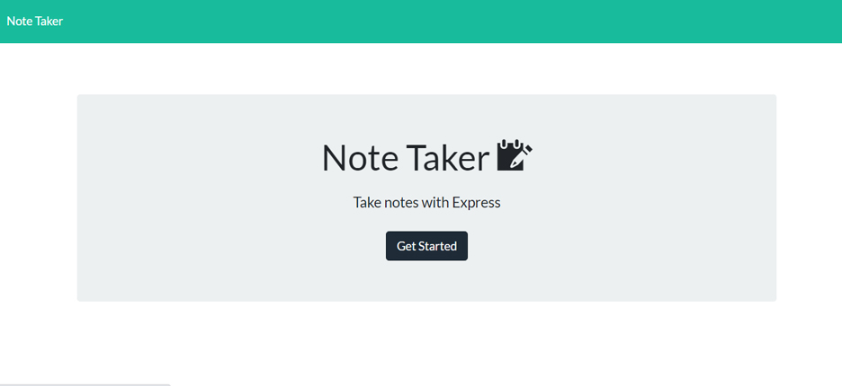

# Note-taking-app
  

## Table of Contents
  * [Description](#Description)
  * [Installation](#Installation)
  * [Usage](#Usage)
  * [Testing](#Testing)
  * [License](#License)


## Description
This application allows users to write notes in their browser window, to save them in the aside section on the left and also update them or delete. <br>

## Installation
To run this application, the user will need to install Node.js, and after that initialize the folder containing the application by typing `npm init -y` in the command line. The `package.json` will hold various metadata relevant to the project. This file is used to give information to npm that allows it to identify the project as well as how to handle the project's dependencies. Then the user can install  all of the required dependencies by typing `npm i`. The project was build with HTML, CSS and JavaScript languages on the front-end. On the back-end, the application is using the Express framework to process the get, post and delete requests to the server.

```
npm init -y 
npm i
``` 
<br>

## Usage
The application is running from the Heroku platform, you can test it by following [this link](https://tranquil-river-38953.herokuapp.com/)
After pushing the Get started button, the user will be taken to a window where he will be able to write a note, save it by clicking on the "save" icon, and also modified them by clicking the "edit" button or remove them from the list with the "delete" button. If the user will reload the page, or closes the browser window and then will reopen, the notes will persist, because they are saved in the database file in JSON format.
<br> Screenshot of the appplication's interface:
<br> 

 <br>
<br>